# Fake Error Screen Generator

A web app to display realistic error screens (Windows BSOD, macOS/Linux Kernel Panic, Ransomware) in fullscreen for pranks and demonstrations.

🌐 **Visit: [screenfake.xyz](https://screenfake.xyz)**

## Available Screens

### Windows

**Windows Blue Screen of Death**
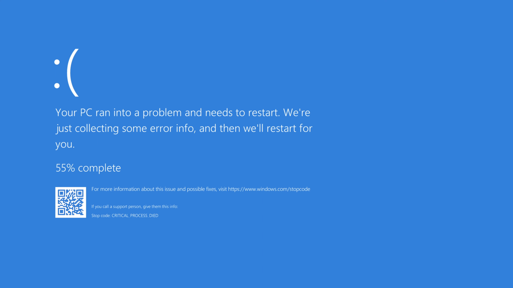

**Windows BSOD (Functional)**

**Windows ACPI Error**
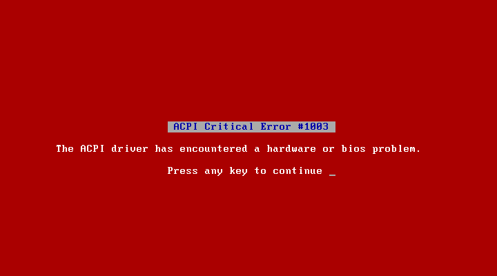

### Linux

**Linux Kernel Panic**
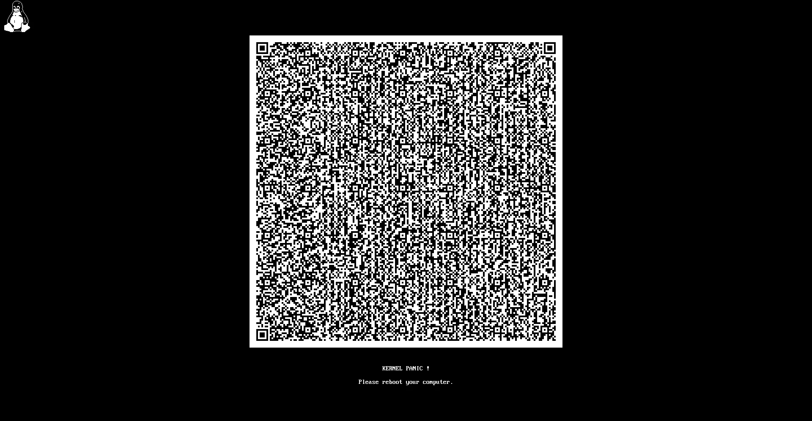

**Linux Kernel Panic**
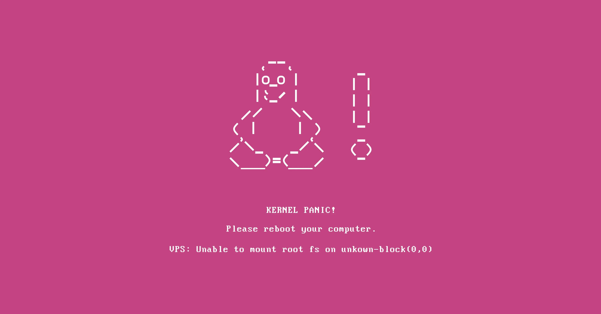

**Linux Kernel Panic**

### macOS

**macOS Kernel Panic**
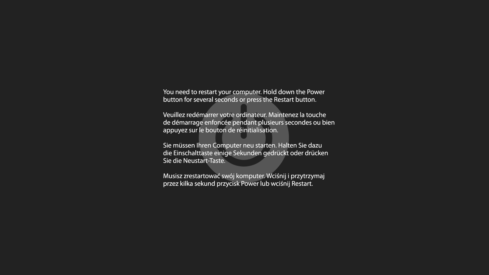

**macOS Startup Error**

**macOS Network Error**
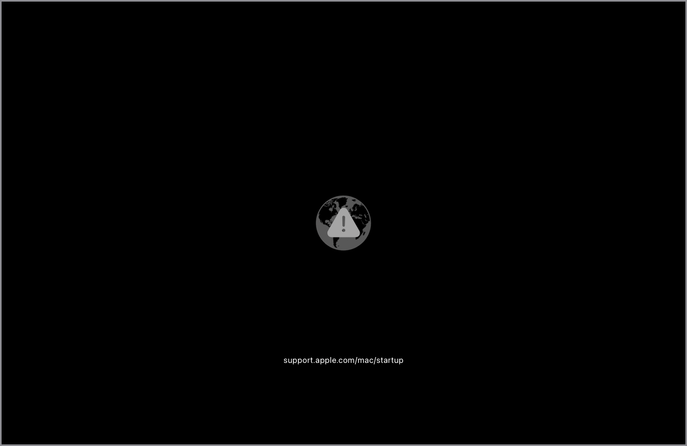

**macOS Prohibited Boot**
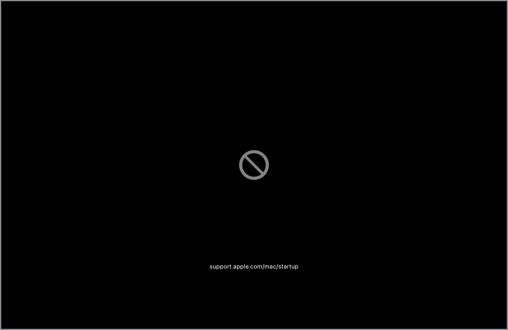

**macOS Boot Warning**
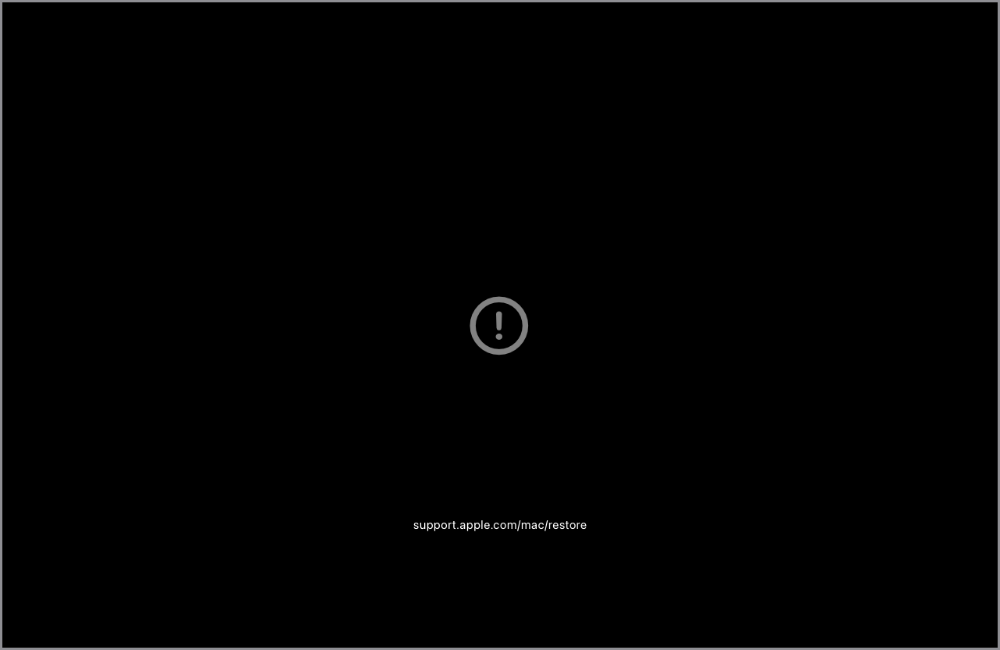

**macOS Missing System**
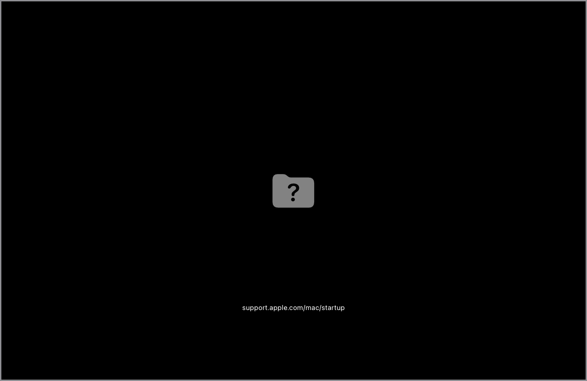

### Ransomware

**WannaCry Ransomware**

**Petya Ransomware**
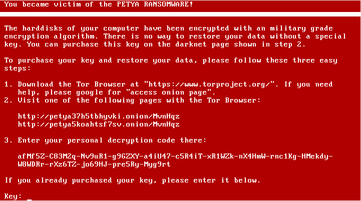

**Retis Ransomware**
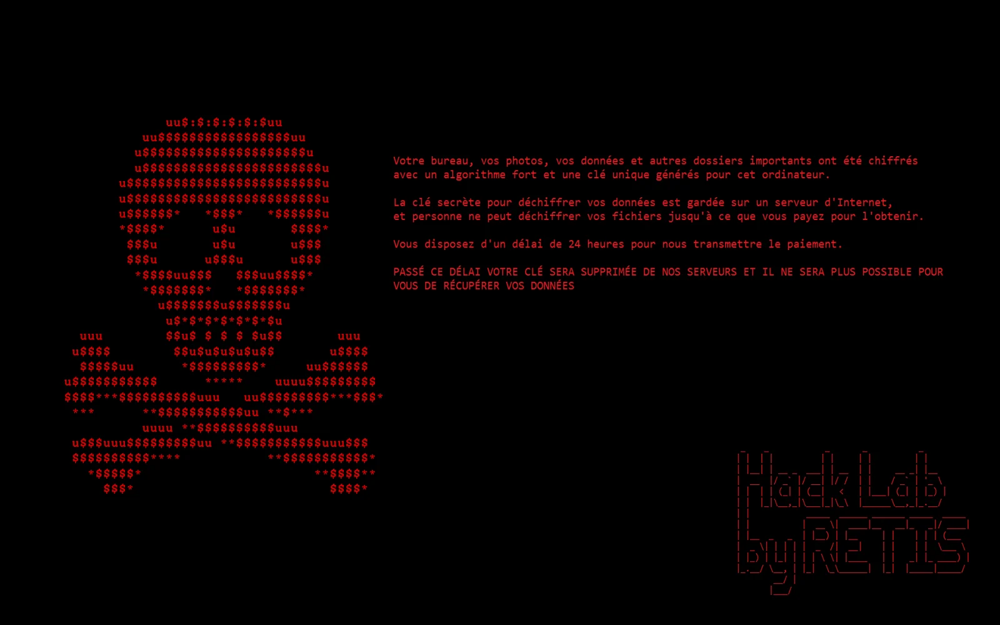